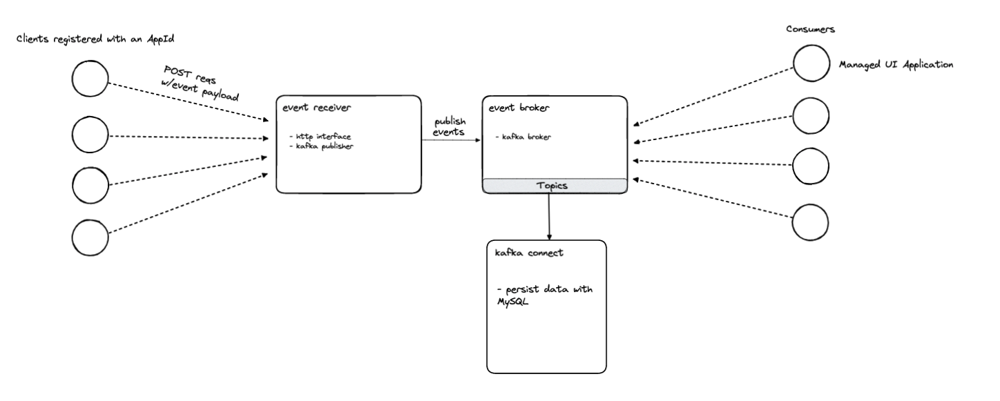

# Event Transporter

Generic kafka service for any application events.

## Desired Functionality

- Receive POST requests of events from clients.
- Publish events to a Kafka broker.
- Persist events with Kafka connect.
- Generate app ID's and monitoring realtime event streams in a managed UI.

## Run it

```bash
# Don't run this yet.
```
